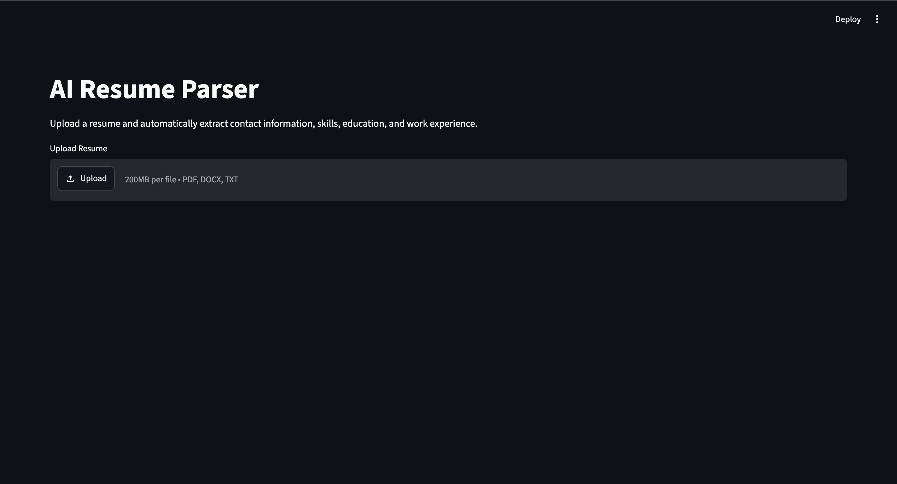
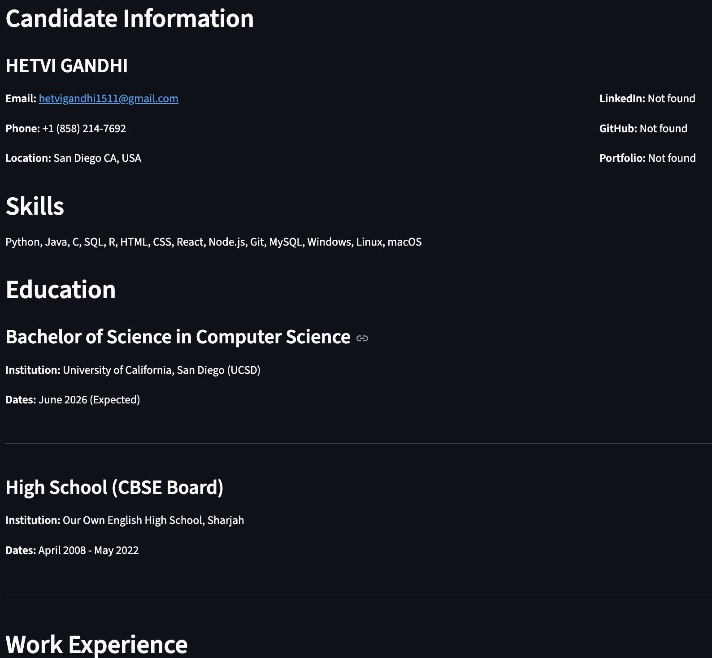
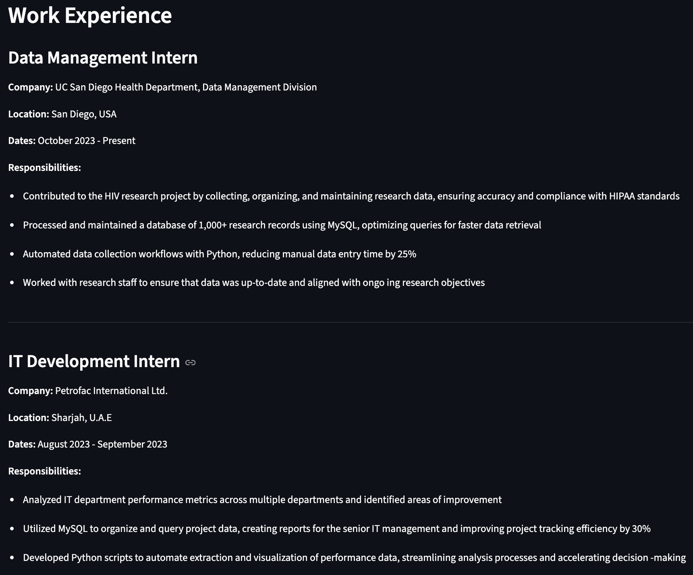

# AI Resume Parser with spaCy

An NLP-based resume parsing application that extracts structured candidate information from PDF, DOCX, and TXT resumes.

The project combines spaCy NLP, regular expressions, rule-based parsing, and PhraseMatcher to convert unstructured resume text into structured candidate data.

## Features

- Supports PDF, DOCX, and TXT resumes
- Extracts candidate name
- Extracts email and phone number
- Detects location
- Detects LinkedIn, GitHub, and portfolio URLs
- Extracts technical skills using spaCy PhraseMatcher
- Extracts education history
- Extracts work experience
- Detects common resume sections
- Exports parsed results to JSON
- Exports parsed results to CSV using Pandas
- Includes an interactive Streamlit web interface
- Includes automated tests using pytest

## Technologies Used

- Python
- spaCy
- Pandas
- Regex
- pypdf
- python-docx
- Streamlit
- pytest

## How It Works

```text
PDF / DOCX / TXT
        |
        v
Text Extraction
        |
        v
Text Cleaning
        |
        v
Section Detection
        |
        +--> Regex ----------> Contact Information
        |
        +--> spaCy NER ------> Candidate Name
        |
        +--> PhraseMatcher --> Skills
        |
        +--> Rules + NER ----> Education
        |
        +--> Rules + NER ----> Work Experience
        |
        v
Structured Resume Data
        |
        +--> JSON
        +--> CSV
        +--> Streamlit UI

## Example Output

```json
{
    "name": "Jane Doe",
    "contact": {
        "email": "jane.doe@example.com",
        "phone": "+971 50 123 4567",
        "location": "Dubai, UAE",
        "linkedin": null,
        "github": null,
        "portfolio": null
    },
    "skills": [
        "Python",
        "React",
        "PostgreSQL",
        "Docker"
    ],
    "education": [
        {
            "degree": "Bachelor of Science in Computer Science",
            "institution": "Example University",
            "dates": "May 2025"
        }
    ],
    "work_experience": [
        {
            "job_title": "Software Engineer Intern",
            "company": "Example Technologies",
            "location": "Dubai, UAE",
            "dates": "June 2024 - August 2024",
            "description": [
                "Developed REST APIs using Python",
                "Worked with PostgreSQL and Docker"
            ]
        }
    ]
}
```
## Screenshots

### Resume Upload



### Parsed Resume




## Project Structure
resume-parser/
│
├── app.py
├── evaluate_parser.py
├── requirements.txt
├── README.md
├── .gitignore
│
├── data/
│   ├── skills.csv
│   └── resumes/
│
├── docs/
│   └── screenshots/
│       ├── upload.png
│       ├── results.png
│       └── results1.png
│
├── output/
│
├── src/
│   ├── __init__.py
│   ├── text_extractor.py
│   ├── text_cleaner.py
│   ├── section_parser.py
│   ├── contact_extractor.py
│   ├── name_extractor.py
│   ├── skills_extractor.py
│   ├── education_extractor.py
│   ├── experience_extractor.py
│   ├── exporter.py
│   └── resume_parser.py
│
└── tests/
    └── test_parser.py

## Installation

### Clone the Repository

```bash
git clone https://github.com/hetvi1511/resume-parser-project.git
cd resume-parser-project
```

### Create a Virtual Environment

```bash
python3 -m venv .venv
```

### Activate the Virtual Environment

On macOS or Linux:

```bash
source .venv/bin/activate
```

On Windows:

```bash
.venv\Scripts\activate
```

### Install Dependencies

```bash
pip install -r requirements.txt
```

### Download the spaCy English Model

```bash
python -m spacy download en_core_web_sm
```

### Run the Application

```bash
streamlit run app.py
```

Then open the local Streamlit URL shown in the terminal, usually:

```text
http://localhost:8501
```

Upload a PDF, DOCX, or TXT resume to view the extracted candidate information.

## Testing

### Run Automated Tests

```bash
pytest
```

### Run the Parser Evaluation Script

```bash
python evaluate_parser.py
```

## NLP Approach

This project uses a hybrid NLP approach rather than relying on a single extraction method.

- Regular expressions are used for structured patterns such as email addresses and phone numbers.
- spaCy Named Entity Recognition is used for person and organization detection.
- spaCy PhraseMatcher is used for technical skill extraction.
- Rule-based parsing is used for resume sections, education, and work experience.
- Pandas is used to export structured resume data to CSV.

## Limitations

Resume layouts vary significantly, so extraction quality may decrease for:

- Multi-column resumes
- Image-only or scanned PDFs
- Heavily designed resumes
- Unusual section headings
- Unconventional education formats
- Unconventional work experience layouts
- PDFs with poor embedded text structure

## Future Improvements

- OCR support for scanned resumes
- Custom spaCy NER model for degree, university, job title, and company entities
- Better multi-column PDF handling
- Improved location extraction
- Broader skill taxonomy
- Batch resume upload
- Candidate comparison dashboard
- Improved handling of poorly encoded PDF text

## Privacy

Uploaded resumes may contain sensitive personal information.

This repository does not include real candidate resumes or generated candidate output files. Resume files placed inside `data/resumes/` and generated files inside `output/` should remain excluded from version control.

## Author

**Hetvi Gandhi**

Computer Science graduate interested in Software Engineering, Artificial Intelligence, and NLP.